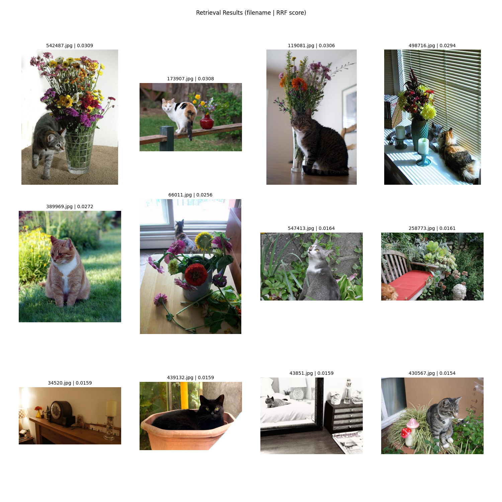
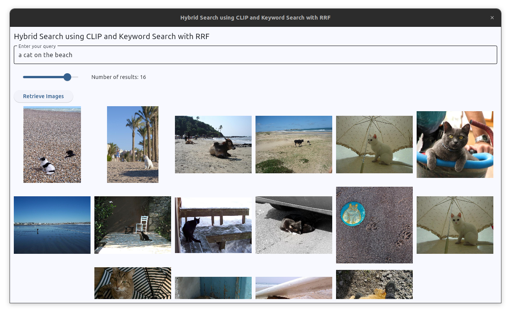

# postgresql-multimodal-retrieval
Multimodal retrieval using Vision Language Model with PostgreSQL database - A full stack implementation.

+ Database: PostgreSQL
+ Vision Language Model: OpenAI CLIP (`transformers` implementation) 
+ Dataset: Hugging Face Datasets
+ Frontend: Flet / Gradio
+ Deployment: Docker
+ Infrastructure: Hugging Face Spaces

Features:
+ Image to image search
+ Text to image search
+ Hybrid search

## Setting up

### Create a conda environment

```bash
conda create -n postgresql-multimodal python=3.10
conda activate postgresql-multimodal
```
### Install PostgreSQL

```bash
conda install -c conda-forge postgresql
psql --version
```

### Install pgvector

```bash
conda install -c conda-forge pgvector
```

### Initialize and start PostgreSQL

```bash
initdb -D mylocal_db
pg_ctl -D mylocal_db -l logfile start
```

### Create a database

```bash
createuser retrieval_user
createdb retrieval_db -O retrieval_user
```

### Install packages

```bash
pip install -r requirements.txt
```
Install the pgmmr package
```
pip install -e .
```

## Usage

### Compute embeddings
Run 

```
python compute_embeddings.py
```

This will compute embeddings for all the images in the database.

### Query
Run hybrid search (vector search and keyword search). The results are ranked using RRF.

```
python query.py "a cat and flower" --num_results 12
```



### Gradio App
Run
```
python gradio_app.py
```

<video controls autoplay src="https://github.com/dnth/postgresql-multimodal-retrieval/assets/6821286/7da5f312-fb3c-448b-b890-69e01d7b9562"></video>


### Flet App

```
flet run flet_app.py
```




## References

+ https://minimaxir.com/2024/06/pokemon-embeddings/
+ https://github.com/minimaxir/pokemon-embeddings/tree/main
+ https://towardsdatascience.com/quick-fire-guide-to-multi-modal-ml-with-openais-clip-2dad7e398ac0
+ https://github.com/pgvector/pgvector
+ https://huggingface.co/nomic-ai
+ https://huggingface.co/datasets/wanghaofan/pokemon-wiki-captions
https://github.com/jamescalam/clip-demos/blob/main/tutorials/00-get-started/00-get-started.ipynb
  
